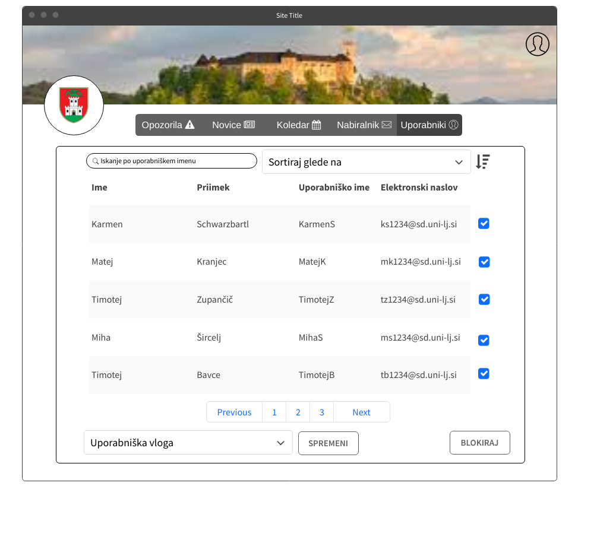

# Dokument zahtev

|                             |                                                                                   |
| :-------------------------- |:----------------------------------------------------------------------------------|
| **Naziv projekta**          | Občinski obveščevalnik                                                            |
| **Člani projektne skupine** | Karmen Schwarzbartl, Matej Kranjec, Timotej Zupančič, Miha Šircelj, Timotej Bavec |
| **Kraj in datum**           | Ljubljana, 30. 3. 2022                                                            |

## Povzetek projekta 

**Občinski obveščevalnik** je aplikacija za komunikacijo med občani in občino.
Občani po registraciji izberejo občino in preko aplikacije pošiljajo opozorila o poškodovani infrastrukturi, kritike, predloge za izboljšave...
Sporočila bo upravnik na občini pregledal in jih po potrebi poslal zunanjemu izvajalcu.
Poleg tega pa bo lahko objavljal opozorila, novice, ankete in ustvarjal dogodke.
Aplikacija nudi tudi administratorsko vlogo, ki lahko blokira uporabnike in briše objave.
Uporabniške vloge so podrobneje opisane v razdelku *Uporabniške vloge*.
Tem sledita *slovar pojmov* z razlago têrminov v tem dokumentu in 
*diagram primerov uporabe*, ki predstavlja interakcijo med akterji in funkcionalnostmi.
Dokument nato vsebuje opise vsake *funkcionalne zahteve*, ki zajema osnovni tok, alternativni tok, izjemni tok, pogoje, posledice, prioriteto in sprejemne teste.
Sledijo *nefunkcionalne zahteve* z omejitvami pri razvoju aplikacije in prikaz *zaslonskih mask*.
Dokument se zaključi s predstavitvijo *vmesnikov zunanjih sistemov*, ki jih bo aplikacija uporabljala in
opisom vmesnika, ki ga bo aplikacija nudila zunanjim sistemom.

## 1. Uvod

Slovenija je sestavljena iz velikega števila občin, ki se med seboj močno razlikujejo, bodisi po številu prebivalcev, 
velikosti ozemlja, ponujenimi aktivnostmi svojim občanom in navsezadnje tudi po stopnji digitalizacije. Kljub vsem naštetim 
raznolikostim, pa imajo vse občine enak cilj, to je zagotoviti čim boljšo kvaliteto življenja svojim občanom, saj je le ta 
v veliki meri odvisna od urejenosti in načina delovanja občine. Pri zagotavljanju čim boljše kvalitete življenja znotraj 
posamezne občine ima ključno vlogo komunikacija med občani in upravniki občine, saj lahko občina le na tak način pridobi 
informacije o interesih njenih občanov. Prav tako ne gre zanemariti komunikacije med samimi občani, s katero se le-ti lahko 
poenotijo glede trenutnih težav in seveda tudi skupni viziji za prihodnost. Na tem mestu nastane težava, saj večina občin nima 
enostavnega sistema, preko katerega bi lahko občani na preprost način prišli v virtualni stik drug z drugim oziroma z upravniki 
občine. Marsikdo izmed nas je zagotovo že imel kakšno idejo, ki bi izboljšala kvaliteto življenja vseh občanov ali pa je 
opazil neko napako ali celo nevarnost, ki bi jo bilo potrebno odpraviti, vendar ni vedel kdo je pravi naslovnik in na kakšen 
način bi mu to lahko sporočil. Prav občani so tisti, ki poznajo dobre in slabe strani njihove občine oziroma njene urejenosti 
tako z vidika izgleda kot tudi z vidika varnosti. Zagotovo vsi vemo za kakšno križišče v naši občini, ki bi zaradi zagotovitve 
večje varnosti moralo biti semaforizirano. Ker pa se tudi vsi občani zavedajo birokracije vse postopkov v občinah, vsi naši 
predlogi ostanejo pri pogovorih z znanci, kar pa žal ne pripomore k reševanju problematike.  Dejstvo je, da ogromno potencialno 
dobrih predlogov nikoli ne pride do ustreznih oseb, še tisti predlogi, ki prispejo v obdelavo, pa so zaradi slabih komunikacijskih 
kanalov deležni počasne obdelave. Aplikacija Občinski obveščevalnik bo poskrbela, da bo komunikacija znotraj občine veliko 
hitrejša in predvsem bolj enostavna, ne glede na njeno velikost in stopnjo digitalizacije. Na ta način bo vsak občan na 
enostaven način aktivno prispeval k lepši in bolj varni občini kot tudi občini, ki bo odsevala interese občanov in bo s 
tem poskrbljeno za boljšo kvaliteto življenja občanov.

**Občinski obveščevalnik** je aplikacija, ki se osredotoča na olajšanje komunikacije znotraj občine. Prebivalci vsake občine
bodo dobili možnost, da na hiter in enostaven način predstavijo svoje predloge oziroma opazke, ki bodo brez vsakršnega njihovega
napora prišle v roke vodilnih na občini. Občina pa lahko na ta način hitro ureja nastale težave in hkrati dobi tudi dober pregled
nad vizijo svojih občanov. Bistvo te aplikacije je to, da zagotavlja oziroma omogoča aktivno sodelovanje občanov pri urejanju občinske
problematike na zelo enostaven, preprost način. Občanom se ne bo potrebno ukvarjati s tem, na koga morajo nasloviti predlog, 
pobudo itd., pač pa se bodo lahko osredotočili zgolj na vsebino. To pa je ključ do dviga kvalitete življenja občanov v posamezni občini.

### Glavne funkcionalnosti

V aplikaciji nastopa več uporabniških vlog, in sicer neprijavljen uporabnik, prijavljen občan, upravnik na občini, zunanji izvajalec 
in administrator. Glavne funkcionalnosti aplikacije se med vlogami razlikujejo. Neprijavljen uporabnik lahko na začetni strani izbere 
željeno občino, prebira predloge in komentarje prijavljenih občanov, obvestila občine in rezultate javnih anket. 
Prav tako aplikacija omogoča prijavo neprijavljenega uporabnika oziroma registracijo, v kolikor le-ta še nima odprtega računa.

Če se neprijavljen uporabnik prijavi v aplikacijo kot občan, ima na voljo vse funkcionalnosti, ki jih ima neprijavljen uporabnik (razen registracije
in prijave). Poleg tega ima tudi možnost pošiljanja pritožbe oziroma predloga upravniku občine, pri čemer mora izpolniti zahtevan
obrazec in po želji označiti lokacijo na zemljevidu. Vsak prijavljen občan lahko tudi komentira javne predloge na začetni strani 
njegovega računa in glasuje na anketah, s čimer prispeva h končni odločitvi občine.

Upravnik na občini ima na voljo poseben pogled, kjer prejme predloge s strani prijavljenih občanov in jih po potrebi posreduje
zunanjemu izvajalcu. Poleg tega ima funkcionalnost ustvarjati ankete, obvestila in dodajati dogodke na koledar, kateri so vidni
prijavljenim občanom. V kolikor upravnik oceni, da je posamezen predlog občana zanimiv, ga lahko javno deli in s tem omogoči
prijavljenim občanom komentiranje predloga.

Administrator ima funkcionalnosti kot prijavljeni občan, poleg tega pa še nekaj novih, kot so možnost dodeljevanja vlog obstoječem uporabniku, 
brisanje objave oziroma komentarja, v kolikor presodi, da gre za neprimerno vsebino. V primeru hujših kršitev 
pravil, lahko tudi blokira prijavljenega občana in mu na ta način onemogoči nadaljnjo komunikacijo.

Če aplikacijo uporabljamo kot izvajalec, imamo na voljo pogled, kjer dostopamo le do objav, ki nam jih je posredoval upravnik 
občine. Ko se s težavo seznanimo in jo tudi opravimo, lahko le-to označimo kot »opravljeno« in to sporočimo upravniku.

### Povzetek nefunkcionalnih zahtev

Od aplikacije se poleg funkcionalnosti zahteva še nekaj nefunkcionalnih zahtev. Aplikacija mora biti dosegljiva na javno
dostopnem spletnem naslovu in sicer najmanj 99 odstotkov časa na mesec, pri čemer je pomembno, da ima aplikacija pri najmanj
1000 hkratnimi uporabniki odzivni čas največ dve sekundi. Ker je varnost podatkov naših uporabnikov ključnega pomena, ima
aplikacija tudi na tem področju nekaj zahtev. Zaradi varnostnega vidika se bodo vsa uporabniška gesla šifrirala in se le v
takšni obliki zapisala v podatkovno bazo. Aplikacija mora delovati v skladu z Splošno uredbo o varstvu podatkov in tudi z Zakonom
o varstvu osebnih podatkov. Razvoj aplikacije bo potekal z uporabo orodja Git.

### Zunanji sistemi

Za določene funkcionalnosti se aplikacija zanaša na zunanje sisteme, in sicer na:

- Vmesnik **Google Calendar API**, s pomočjo katerega lahko uporabniki aplikacije sledijo pomembnim dogodkom v občini.
- Vmesnik **Leaflet**, s pomočjo katerega lahko prijavljeni uporabniki označijo lokacijo obvestila, na katerega se nanaša.

Aplikacija Občinski obveščevalnik bo ponujala tudi lastni vmesnik, ki bo na voljo zunanjim sistemom. Zunanji sistemi bodo
z njim lahko pridobili javna obvestila, ki bodo objavljena znotraj aplikacije. Prav tako bodo imeli možnost pošiljanja predlogov,
posodabljanja in brisanja le teh, vendar bo za te klice potrebna ustrezna avtentikacija.

## 2. Uporabniške vloge

Občinski obveščevalnik bo vseboval 5 sledečih uporabnikov.

**Upravnik**

Upravnik bo uporabnik, ki bo imel možnost ustvarjanje dogodkov, objavljanja anket in raznih obvestil, ki bodo specifične za posamezno občino. Prav tako bo lahko sprejemal in zavračal predloge ali pritožbe ter jih posredoval izvajalcem. 

**Prijavljen občan**

Prijavljen občan bo lahko za posamezno občino oddal predlog za izboljšavo življenja v občini, prav tako pa bo lahko izrazil konstruktivne pritožbe. Občinski Obveščevalnik bo deloval tudi kot glasnik občine in prijavljeni občani bodo lahko po njem glasovali, iskali objave in jih komentirali, ter neprimerne komentarje prijavili.

**Neprijavljen uporabnik**

Neprijavljeni občan bo lahko uporabljal občinski obveščevalnik kot spletni glasnik, ter na njem iskal in komentiral objave. Ta uporabnik ne bo mogel dodajati svojih pritožb in predlogov, da ne bo prihajalo do nepotrebnih objav, ki jih ne bomo bili sposobni cenzurirati.

**Administrator**

Administrator je eden izmed najpomembnejših uporabnikov, saj bo skrbel za red Občinskega Obveščevalnika. Nadziral bo objave in s tem izvajal cenzuro nad neprimernimi ali zlonamernimi predlogi oziroma pritožbami. Prav tako bo imel možnost blokiranja uporabnika, ko bo ta objavil preveč neprimernih predlogov ali pritožb.

**Izvajalec**

Izvajalci bodo uporabniki, ki bodo imeli najmanj funkcionalnosti na Občinskem Obveščevalniku. S strani občine bodo dobili pritožbo ali predlog, za katerega bodo poskrbeli, da se bo popravil odpravil. Ko bodo slednje opravili bodo v aplikaciji označili predlog kot opravljen in s tem opravili svojo nalogo.

## 3. Slovar pojmov

Opredelitev têrminov, ki jih uporabljamo v nadaljevanju dokumenta.

| Pojem | Opredelitev |
| ----- | ----------- |
| Aplikacija | Uporabniški računalniški program, ki ga razvijalci razvijejo zato, da uporabnikom programa zagotavlja določene uporabne lastnosti. |
| Upravnik | Tip uporabnika, ki skrbi za upravljanje občine. |
| Administrator | Tip uporabnika, ki ima nadzor nad aplikacijo in skrbi za red. |
| Izvajalec | Tip uporabnika, ki zastopa podjetje katero nudi svoje storitve občini. |
| Funkcionalnost | Naloga, ki jo je del aplikacije zmožen opraviti (nimam boljše ideje kako to opisat?) |
| Registracija | Postopek, s katerim si neregistriran uporabnik ustvari račun. |
| GDPR | General Data Protection Regulation - splošna uredba Evropske unije, s katero so okrepili zaščito osebnih podatkov oseb znotraj Evropske unije. |
| ZVOP | Zakon o varstvu osebnih podatkov. |
| Objava | Obvestilo od upravnika, ki je vidno vsem uporabnikom. |
| Sortiranje | Razporejanje rezultatov glede na določen atribut. |
| Šifriranje gesla | Pretvorba geslo v tako obliko, da ga praviloma nepooblaščene osebe ne morejo razumeti. |
| API | Application programming interface - Vmesnik za namensko programiranje je množica rutin, protokolov in orodij za izgradnjo programske opreme in aplikacij.|
| Implementacija | Uresničitev določen tehničnih rešitev |
|Občan | Prebivalec občine, ki sistem uporablja vendar ne v okviru službe |
| Uporabnik | Oseba, ki aplikacijo uporablja |
|Opozorilo | objava s strani občine ki občane seznanja s tem na kaj naj bodo pozorni |
| Novica | objava s strani občine, ki občane seznanja z dogajanjem v občini |
| Obvestilo | sporočilo, ki ga občan pošlje v obravnavo upravniku (lahko pritožba ali predlog) |
| Pritožba | obvestilo s strani občana, ki sporoča nezadovoljstvo v povezavi z delovanjem občine |
| Predlog | obvestilo s strani občana o tem kako bi lahko izboljšali delovanje občine |

## 4. Diagram primerov uporabe

Spodaj prikazani Diagram primerov uporabe prikazuje do katerih funkcionalnosti lahko dostopa posamezen uporabnik v našem sistemu.

![DPU](https://teaching.lavbic.net/plantuml/png/hLVBRjiu5DtxAuXaqoxItG23GH50YftKOzSK_CW0tGIqn3Yq6DAWP6N6Wtv2Fw8VChlcl-Ro8OaofG052YH6p7FVvzvBfiYPE115dj6MfFbEoQF8KicbGgKYeW28Yd9KD58PVIH7NgxftsN4sKuy0unI-A3AapeMD2K5HV-Ea6VtnjXzUM8brUTIPLJPiylVRkFV9pTmIfIIB_Pmoq5pzDKpIz9IgjZJioBd0hqEHvm-bgYKIB7TKuaofcXQCYb68wE4BXB5zgJYUogGtFxuHiG5YbOemQWMMD13At8yI4MsWkL6Qf7WMcfwgiYUS9eQO5eVHzap4wo0ei9N0qKrj3aeKjMMDesXEIMFd9RczCkaFhsJSiSfcabECs8DpV1eDDBP4A4XKDnHaP4Bg3uKjARYOlK9R-PZz2cwdrmWTBccwPE0-kp-yOK-RrPh9t9vO2BtiHjF_tAbCw5TvRzyWVXOC46B0WI0mqw06ChB1B06XQxew_SVtsX5kAb0D-Inp2XKko9YJr45iTAsxiJalfpSFIpm_L0wYQBWCMkrP6LPVTWaU1d5OP8nbpbJnk6PgtYERsRzYKzFMyKAo0QwWrhUlyJBwQfV6fkGSgb7XoX8psZWk_d337yUP6ObLMa3C-AhJeNRI8hSn7wGIB3JqSQIBFg5eJfRb-j1qGmyoWen4OIMB2SFy3iEg-LPa0TvaefnRK38YgLcYi1dOmB7RnfGz0IB1SQZGdiz3q-8YDprlrQF5hF9EhGmCy7MGRGCw5fsIzdgR1JTkxJb8-EMtyqIaiItWqgMDbz3Yq_dOKXBkZEJdiAsgBiqb8AcWQWxLOAkcIwZKFIEaqBQAH34beKPXRivVDJYFn6gHu1y_SxutbMleaN9kDEOhl7hV_5aqBxCCg9fwgXXd8JnD_KsAdH76XslzCCph9SkGKAltsUgjCkmGwT_HlUH6Q3UcND6Qk4mn5ysNi7kiSC0Kr5FY0rYZ9kUQEjKb1KaPLmObcqmcvLk_a0QjYEniXbCRfOJtHovTp6CnrhBhseGd3TYlJvgkOCiU4XsqbaBNayLi4vSmpPC8sPlnlJeBjRfMzwS0UCHc3Cgsjy3TbfjCvu4CJU87GzpI-IoX3-XwwYGjYqNiqMd5C3g55rbyaLSNQDtnl1xi7nK1wuV9_N9Xm-0QkNtw0_qyIEyUk1glRv6e0zt6jpMdWrW54p0dI5ssaG7C-CtX6gUXZ3B_Q3Tjq7DZeywJrTN0CEh0RKo9a-Wf9lccK6xdePpd0GEpt4SluMQ3Jyai1e2tCNfmS1CqXVsJb4gG3lfZte8Da4FWNNC_RXZlG-4HUaXxvfrw-Y15nzoGeORio83ThhU6Wkz3csD-X1zYmn5sHItYRGviZtJRjute_CTwBjaSHOwm5j-rDns4BWv1v26rJxGOtK8DgmEWJMhVVXguBmjbKFjJzGJCYotBbA_HnlCEp5bDe_FynqKYjbdfvLZ8kN7ZFOBkdTpQ34wRvWWLjSjOGvjpNin7FSXRTK222xMlkD1vpLfFQ2RmxgsxdixMFWsQ5xpVyl_)

**Diagram primerov uporabe** (izvorna koda :bar_chart: [PlantUML](../gradivo/plantuml/DPU.puml))

## 5. Funkcionalne zahteve

V tem razdelku podrobno opišite posamezne funkcionalnosti, ki jih vaša aplikacija ponuja svojim uporabnikom. Za vsako funkcionalnost navedite naslednje podatke:

### Registracija

#### Povzetek funkcionalnosti

Neregistrirani uporabnik se lahko registrira v aplikacijo ter si s tem pridobi sposobnost prijave in vse funkcionalnosti prijavljenega občana.

#### Osnovni tok

1. Neregistriran občan izbere funkcionalnost Registracija
2. Prikaže se obrazec za registracijo
3. Uporabnik vpiše zahtevane podatke
4. Uporabnik označi vlogo izvajalca (checkbox)
5. Uporabnik potrdi vnos podatkov s pritiskom na gumb
6. Uporabnik prejme potrditveni email na prej vneseni naslov
7. Uporabnik potrdi registracijo
8. Aplikacija obvesti uporabnika, da je bil uspešno registriran

#### Izjemni tokovi

1. Račun z izbranim elektronskim naslovom že obstaja, zato se uporabnik ne mora uspešno registrirati v sistem.
2. Uporabnik je vnesel neveljavne vrednosti v polja potrebna za registracijo, zato se ne mora uspešno registrirati.
3. Uporabnik ni izpolnil vseh potrebnih polj za registracijo, zato se ne mora uspešno registrirati.
4. Uporabnik je pravilno vnesel podatke za registracijo vendar ni registracije potrdil po prejemu e-mail pošte. 5. Registracija tako ni zaključena in uporabnik se ne mora prijaviti v sistem. 

#### Pogoji

Za uspešno registracijo uporabnikov e-mail naslov še ne sme biti registriran v sistem

#### Posledice

Po uspešni registraciji se prej ne registriranemu uporabniku ustvari uporabniški račun. Tako mu je omogočena prijava v aplikacijo in dostop do vseh funkcionalnosti prijavljenih uporabnikov.

#### Posebnosti

Hramba podatkov in postopek registracije morata biti skladna z GDPR in ZVOP.

#### Prioritete identificiranih funkcionalnosti

Must have

#### Sprejemni test

| Funkcija, ki se testira | Začetno stanje sistema | Vhod | Pričakovan rezultat |
| --- | --- | --- | --- |
| Registracija uporabnika | Uporabnik ni registriran v sistem| Pravilno izpolni vsa polja za registracijo ter registracijo potrdi na email naslovu | Uporabnik je registriran v sistem, vanj se lahko prijavi|
| Registracija uporabnika | Uporabnik je registriran v sistem | Pravilno izpolni vsa polja, vendar vnese naslov, ki je že registriran |Sistem uporabniku sporoči, da uporabnik s tem mailom že obstaja |
| Preverjanje izpolnjenih polj | Uporabnik ni registriran v sistem | Uporabnik ne izpolni vseh polij potrebnih za registracijo | Sistem uporabnika obvesti, da morajo biti vsa polja izpolnjena |
| Preverjanje pravilnosti polj| Uporabnik ni registriran v sistem| Uporabnik polj za registracijo ne izpolni ustrezno (npr. email naslov se ne konča s pravo končnico, telefonska številka je predolga…)| Sistem uporabnika opozori, da so polja narobe izpolnjena. Registracija je onemogočena.|
| Potrjevanje registracije preko emaila| Uporabnik ni registriran v sistem| Uporabnik ustrezno izpolni polja, vendar ne potrdi email sporočila| Uporabnik ni registriran v sistem. |

### Prijava

#### Povzetek funkcionalnosti

Registrirani uporabnik se lahko prijavi v aplikacijo s podatki, ki jih je vpisal pri registraciji ter si s tem pridobi več funkcionalnosti znotraj spletne strani.

#### Osnovni tok

1. Uporabnik ni prvi registriani v občini
2. Registrirani uporabnik vpiše svoje uporabniško ime in geslo
3. S pritiskom na gumb Prijavi potrdi prijavo
4. Registriran uporabnik je prijavljen in lahko dostopa do vseh funkcionalnosti prijavljenega uporabnika 

#### Alternativni tok

1. Uporabnik je prvi vpisani pri občini
2. Registrirani uporabnik vpiše svoj elektronski naslov in geslo
3. S pritiskom na gumb Prijavi potrdi prijavo
4. Uporabnik je prijavljen v sistem kot administrator

#### Izjemni toki

1. Neregistrirani uporabnik se je poskusil prijaviti. Aplikacija vrne sporočilo o neobstoju uporabnika.
2. Registrirani uporabnik je vpisal napačno geslo. Aplikacija mu sporoči, da je vpisano geslo napačno. 

#### Pogoji

Za uspešno prijavo v sistem mora biti uporabnik že predhodno registriran. Prav tako ne sme biti trenutno prijavljen.

#### Posledice

Registriran uporabnik je prijavljen v sistem in ima dostop do vseh funkcionalnosti prijavljenega uporabnika. 

#### Posebnosti

Podatki se morajo pošiljati po varni povezavi

#### Prioritete identificiranih funkcionalnosti

Must have

#### Sprejemni test

| Funkcija, ki se testira | Začetno stanje sistema | Vhod | Pričakovan rezultat |
| --- | --- | --- | --- |
| Prijava uporabnika | Uporabnik je registriran | Pravilno vpisana email in geslo. Pritisk na gumb Prijavi | Uporabnik je prijavljen v sistem, omogočene so mu njegove funkcionalnosti |
| Preverjanje gesla | Uporabnik je registriran | Pravilni elektronski naslov in napačno geslo | Sistem uporabnika obvesti, da je bilo geslo napačno. Prijava ni uspešna |
| Preverjanje email naslova | Uporabnik ni registriran | Vpisan neregistriran email naslov in neznano geslo | Sistem uporabniku sporoči, da uporabnik s tem email naslovom ne obstaja. Prijava ni uspešna |
| Preverjanje izpolnjenih polj | Uporabnik je lahko registriran ali neregistriran | Uporabnik ne izpolni vseh potrebnih polj | Sistem ga opozori, da morajo biti izpolnjena vsa polja. Prijava ni uspešna. |

### Pošiljanje pritožbe/predloga s strani občana

#### Osnovni tok

1. Občan izbere funkcionalnost Pošlji pritožbo/predlog
2. Občan izpolni obrazec za predlog ali pritožbo 
3. Občan na zemljevidu označi kraj pritožbe ali predloga (če želi)
4. Občan pošlje pritožbo/predlog na vpogled

#### Izjemni tok

Občan ne izpolni vseh potrebnih polj. Pošiljanje pritožbe/ predloga je onemogočeno.

#### Pogoji 

Občan mora biti prijavljen v sistem

#### Posebnosti

Ni posebnosti

#### Prioritete identificiranih funkcionalnosti

Must have

#### Sprejemni test

| Funkcija, ki se testira | Začetno stanje sistema | Vhod | Pričakovan rezultat |
| --- | --- | --- | --- |
| Pošiljanje pritožbe/predloga | Prikazan je obrazec za vnos pritožbe/predloga | Izpolnjena so vsa potrebna polja |Pritožba/predlog je oddana |
| Pošiljanje pritožbe/predloga | Prikazan je obrazec za vnos pritožbe/predloga | Vsa potrebna polja niso izpolnjena | Sistem uporabniku sporoči, da niso izpolnjena vsa potrebna polja | 

### Objava novice/opozorila s strani občine

#### Osnovni tok

1. Prijavljen upravnik izbere funkcionalnost objave novice/obvestila
2. V obrazec za objavo obvestila vpiše novico/obvestilo
3. S pritiskom na gumb objavi novico/obvestilo
4. Aplikacija sporoči, da je bila novica/obvestilo uspešno objavljena

#### Izjemni tok

1. upravnik ni izpolnila vseh obveznih polj za objavo novice/obvestila. Sistem sporoči, da niso izpolnjena vsa potrebna polja.

#### Pogoji

Uporabnik mora imeti pravice upravnika

#### Posledice

Novica/opozorilo je objavljeno in vidno vsem na spletni strani

#### Posebnosti

Ni posebnosti

#### Prioritete identificiranih funkcionalnosti

Must have

#### Sprejemni test

| Funkcija, ki se testira | Začetno stanje sistema | Vhod | Pričakovan rezultat |
| --- | --- | --- | --- |
| Objava novice/obvestila | Prikazan je obrazec za vnos obvestila/novice| Izpolnjena so vsa potrebna polja |Novica/obvestilo je vidno vsem uporabnikom |
| Objava novice/obvestila | Prikazan je obrazec za vnos obvestila/novice| Vsa potrebna polja niso izpolnjena |Sistem uporabnika obvesti, da morajo biti izpolnjena vsa polja |

### Urejanje oddanega predloga

#### Povzetek funkcionalnosti

Občan lahko uredi že oddani predlog.

#### Osnovni tok

1. Prijavljen občan izbere predlog iz seznama njegovih oddanih predlogov
2. Prijavljen občan klikne gumb Uredi
3. Aplikacija prijavljenemu občanu prikaže obrazec za urejanje oddanega predloga
4. Prijavljen občan uredi predlog in potrdi spremembo
5. Aplikacija prijavljenega občana obvesti, da je bila sprememba uspešna
   
#### Izjemni tok(ovi)

- Prijavljen občan vnese neustrezno besedilo. Aplikacija ga opozori o neustreznem vnosu.

#### Pogoji

Prijavljen občan mora imeti predhodno oddan predlog, da ga lahko ureja.

#### Posledice

Po urejanju oddanega predloga se na seznamu predlogov izbrani predlog spremeni.

#### Posebnosti

Funkcionalnost nima posebnosti.

#### Prioritete identificiranih funkcionalnosti

Should have

#### Sprejemni testi

| Funkcija, ki se testira       | Začetno stanje sistema                                                                   | Vhod                         | Pričakovan rezultat                     |
|-------------------------------|------------------------------------------------------------------------------------------|------------------------------|-----------------------------------------|
| Izbiranje predloga            | Prijavljen občan ima oddan vsaj en predlog                                               | Predlog prijavljenega občana | Prikaže se obrazec za urejanje predloga |
| Urejanje predloga             | Prijavljen občan je izbral predlog za urejanje, prikazan je obrazec za urejanje predloga | Spremenjen predlog           | Predlog je ustrezno popravljen          |
 | Preverjanje ustreznosti vnosa | Prikazan je obrazec za urejanje predloga                                                 | Neustrezen vnos              | Prikaže se opozorilo o napačnem vnosu   |

### Komentiranje objave

#### Povzetek funkcionalnosti

Prijavljen občan lahko odda komentar na objavo iz strani občine. Komentar lahko oddata tudi upravnik in admin.

#### Osnovni tok

1. Prijavljen občan izbere objavo iz seznama objav
2. Prijavljen občan klikne gumb za dodajanje komentarja
3. Prijavljen občan napiše komentar in potrdi vnos
4. Objavi se doda komentar
    
#### Alternativni tok(ovi)

**Alternativni tok 1**:
1. Upravnik izbere objavo na seznamu
2. Upravnik klikne gumb za dodajanje komentarja
3. Upravnik napiše komentar in potrdi vnos
4. Objavi se doda komentar
  
**Alternativni tok 2**:
1. Administrator izbere objavo na seznamu
2. Administrator klikne gumb za dodajanje komentarja
3. Administrator napiše komentar in potrdi vnos
4. Objavi se doda komentar

#### Izjemni tok(ovi)

- Prijavljeni občan, upravnik ali administrator vnese neustrezno besedilo ali pa ne vnese nič. Aplikacija ga opozori o neustreznosti komentarja.

#### Pogoji

Na voljo mora biti vsaj ena objava, da jo lahko prijavljeni občan, upravnik ali administrator komentirajo.

#### Posledice

Na seznamu komentarjev objave se doda nov komentar.

#### Posebnosti

Funkcionalnost nima posebnosti.

#### Prioritete identificiranih funkcionalnosti

Should have

#### Sprejemni testi

| Funkcija, ki se testira | Začetno stanje sistema | Vhod | Pričakovan rezultat |
| --- | --- | --- | --- |
| Obrazec za dodajanje komentarja | Prikazana je objava | Klik na gumb za komentiranje | Prikaže se obrazec za oddajanje komentarja |
| Preverjanje pravilnosti vnosa | Prikazan je obrazec za vnos komentarja  | Komentar z neustrezno vsebino | Komentar ni sprejet, prijavljeni občan, administrator ali upravnik je obveščen o napačnem vnosu |
| Oddajanje komentarja | Prikazan je obrazec za vnos komentarja  | Ustrezen komentar | Komentar je dodan na seznam komentarjev objave |

### Ustvarjanje ankete

#### Povzetek funkcionalnosti

Upravnik lahko ustvari anketo ter omogoči občanom, da na njej glasujejo.

#### Osnovni tok

1. Upravnik izbere funkcionalnost dodajanja ankete
2. Upravnik vnese vprašanje ter možne odgovore
3. Upravnik potrdi vnos, anketa se pojavi na seznamu objav

#### Izjemni tok(ovi)

- Upravnik vnese neustrezno besedilo
- Upravnik doda premalo možnih odgovorov

#### Pogoji

Anketo lahko doda le upravnik iz občine.

#### Posledice

Na seznam objav se doda anketa.

#### Posebnosti

Funkcionalnost nima posebnosti.

#### Prioritete identificiranih funkcionalnosti

Must have

#### Sprejemni testi

| Funkcija, ki se testira | Začetno stanje sistema | Vhod | Pričakovan rezultat |
| --- | --- | --- | --- |
| Dodajanje ankete | Prikazan je obrazec za dodajanje ankete | Vprašanje in možni odgovori | Na seznam objav se doda anketa |
| Preverjanje vnosa | Prikazan je obrazec za dodajanje ankete | Neustrezen vnos | Upravnik je obveščen o neustreznem vnosu |

### Obveščanje o objavi z neprimerno vsebino

#### Povzetek funkcionalnosti
Občan ali upravnik na občini lahko administratorju pošlejta obvestilo o objavi, ki vsebuje neprimerno vsebino.

#### Osnovni tok
1. Občan med uporabo aplikacije zasledi objavo z vsebino, ki se mu zdi neprimerna.
2. Klikne na objavo z neprimerno vsebino.
3. Sistem prikaže obvestilo, ki uporabnika sprašuje ali želi poslati obvestilo administratorju.
4. Uporabnik potrdi pošiljanje obvestila.
5. Sistem prikaže obvestilo o uspešno poslanem obvestilu.

#### Alternativni tok
Funkcionalnocs nima alternativnega toka.

#### Izjemni tok
- Uporabnik je prijavljen kot administrator. Objavo z neprimerno vsebino lahko takoj izbriše. (opis funkcionalnosti v naslednji točki)

#### Pogoji
Pri funkcionalnosti ***Obveščanje o objavi z neprimerno vsebino*** mora biti uporabnik prijavljen kot občan ali upravnik na občini.
V nasprotnem primeru mu funkcionalnost ni na voljo.
Če je prijavljen kot administrator, lahko objavo z neprimerno vsebino takoj izbriše.

#### Posledice
Administrator s strani uporabnika prejem obvestilo o objavi z neprimerno vsebino. 
Glede na dodatno presojo administratorja bo objava izbrisana ali ne.

#### Posebnosti
Funkcionalnost nima posebnosti.

#### Prioriteta
Could have

#### Sprejemni testi
| Funkcija, ki se testira                          | Začetno stanje sistema              | Vhod                                                                                            | Pričakovan rezultat                                              |
|--------------------------------------------------|-------------------------------------|-------------------------------------------------------------------------------------------------|------------------------------------------------------------------|
| Obveščanje o objavi z neprimerno vsebino         | Prikaz objave z neprimerno vsebino. | Občan ali upravnik na občini klikne na objavo in potrdi pošiljanje obvestila administratorju.   | Administrator prejme obvestilo o objavi z neprimerno vsebino.    |
| Preklic obveščanja o objavi z neprimerno vsebino | Prikaz objave.                      | Občan ali upravnik na občini klikne na objavo in prekliče pošiljanje obvestila administratorju. | Administrator ne prejme obvestila o objavi z neprimerno vsebino. |
| Neuspešno poslano obvestilo                      | Prikaz objave z neprimerno vsebino. | Napaka pri pošiljanju obvestila.                                                                | Sistem opozori uporabnika, da je prišlo do napake.               |

### Izbris objave

#### Povzetek funkcionalnosti
Administrator lahko izbriše objavo (npr. komentar) z neprimerno vsebino o kateri je lahko opozorjen s strani uporabnikov. 

#### Osnovni tok
1. Administrator zasledi komentar z neprimerno vsebino.
2. Klikne na objavo.
5. Sistem prikaže opozorilo za potrditev izbrisa objave.
6. Administrator potrdi izbris objave.
7. Sistem prikaže obvestilo o uspešnem izbrisu objave.

#### Alternativni tok
1. Administrator prejme sporočilo s strani uporabnika, ki opozarja na neprimerno vsebino.
2. Administrator se z klikom na povezavo v sporočilu, premakne na objavo o kateri je obveščen.
3. V primeru, da je vsebina objave neprimerna, administrator objavo izbriše z klikom na gumb za izbris.
4. Sistem prikaže obvestilo za potrditev izbrisa objave.
5. Administrator potrdi izbris objave.
6. Sistem prikaže obvestilo o uspešnem izbrisu objave.

#### Izjemni tokovi
- Administrator v opozorilu za potrditev izbrisa objave izbere opcijo prekliči. Objava ni izbrisana.
- Administrator med pregledom objave, o kateri je bil obveščen s strani uporabnika, ne zasledi neprimerne vsebine. Objave ne izbriše.

#### Pogoji
Pri funkcionalnosti ***Izbris objave*** mora biti uporabnik v sistem prijavljen kot administrator.
V nasprotnem primeru mu funkcionalnost ni na voljo.

#### Posledice
Objava z neprimerno vsebino se izbriše in tako jo uporabniki ne vidijo več.

#### Posebnosti
Funkcionalnost nima posebnosti.

#### Prioriteta
Could have

#### Sprejemni testi
| Funkcija, ki se testira | Začetno stanje sistema                    | Vhod                                                       | Pričakovan rezultat                                            |
|-------------------------|-------------------------------------------|------------------------------------------------------------|----------------------------------------------------------------|
| Izbris objave           | Prikazana je objava z neprimerno vsebino. | Administrator klikne na gumb za izbris in potrdi izbris.   | Prikaže se opozorilo o uspešnem izbrisu in objava se izbriše.  |
| Preklic izbrisa objave  | Prikazana je objava.                      | Administrator klikne na gumb za izbris in prekliče izbris. | Objava se ne izbriše.                                          |
| Neuspešen izbris        | Prikaz objave z neprimerno vsebino.       | Napaka pri brisanju.                                       | Sisem opozori uporabnika, da je pri brisanju prišlo do napake. |

### Blokiranje uporabnika

#### Povzetek funkcionalnosti
Administrator lahko blokira uporabnika in mu s tem onemogoči nadaljno objavljanje in pošiljanje predlogov.

#### Osnovni tok
1. Sistem prikaže seznam uporabnikov.
2. Administrator klikne na gumb za blokiranje, ki stoji v razdelku določenega uporabnika.
3. Sistem prikaže obvestilo za potrditev blokiranja uporabnika.
4. Administrator potrdi blokiranje uporabnika.
5. Sistem prikaže obvestilo o uspešnem blokiranju uporabnika.

#### Alternativni tok
Funkcionalnost nima alternativnega toka.

#### Izjemni tokovi
- Administrator v opozorilu za potrditev blokiranja uporabnika izbere opcijo prekliči. Uporabnik ni blokiran.

#### Pogoji
Pri funkcionalnosti ***Blokiranje uporabnika*** mora biti uporabnik prijavljen kot administrator. 
V nasproten primeru mu funkcionalnost ni na voljo.

#### Posledice
Blokirani uporabnik ne mora več posredovati obvestil/priporočil in objavljati.
Še vedno lahko spremlja obvestila in novice, ki so objavljene s strani občine in ostalih uporabnikov.

#### Posebnosti
Funkcionalnost nima posebnosti.

#### Prioriteta
Could have

#### Sprejemni testi
| Funkcija, ki se testira       | Začetno stanje sistema           | Vhod                                                                             | Pričakovan rezultat                                                                                  |
|-------------------------------|----------------------------------|----------------------------------------------------------------------------------|------------------------------------------------------------------------------------------------------|
| Blokiranje uporabnika         | Prikaz seznama vseh uporabnikov. | Administrator klikne na gumb za blokiranje uporabnika in potrdi blokiranje.      | Prikaže se obvestilo o uspešnem blokiranju uporabnika in blokirani uporabnik ne mora več objavljati. |
| Preklic blokiranja uporabnika | Prikaz seznama vseh uporabnikov. | Administrator klikne na gumb za blokiranje uporabnika in izbere opcijo prekliči. | Uporabnik ni blokiran.                                                                               |
| Neuspešno blokiranje          | Prikaz seznama vseh uporabnikov. | Napaka pri blokiranju uporabnika.                                                | Sistem opozori uporabnika, da je prišlo do napake pri blokiranju.                                    |

### Glasovanje na anketi

#### Povzetek funkcionalnosti

Prijavljen občan lahko glasuje na anketi, ki jo je predhodno ustvaril upravnik.

#### Osnovni tok

1. Sistem prikaže seznam novic.
2. Prijavljen občan izbere anketo na kateri želi glasovati.
3. Prijavljen občan označi izbrane odgovore.
4. Prijavljen občan potrdi vnos
5. Sistem prikaže obvestilo, da je bil glas uspešno zabeležen.

#### Alternativni tok(ovi)

#### Alternativni tok 1:

1. Sistem prikaže seznam novic.
2. Administrator izbere anketo na kateri želi glasovati.
3. Administrator označi izbrane odgovore.
4. Administrator potrdi vnos
5. Sistem prikaže obvestilo, da je bil glas uspešno zabeležen.

#### Izjemni tok(ovi)

- Uporabnik poskuša oddati glas brez da bi izbral kakšen odgovor. Sistem prikaže ustrezno obvestilo.
- Uporabnik ne potrdi vnosa ampak izbere možnost prekliči. Sistem nas preusmeri na stran vseh odprtih anket.

#### Pogoji

1. Uporabnik mora biti prijavljen kot prijavljen občan ali administrator.
2. Uporabnik pri posamezni anketi še ni oddal glasu.

#### Posledice

Oddan glas uporabnika se upošteva pri končnem rezultatu ankete.

#### Posebnosti

Funkcionalnost nima posebnosti.

#### Prioritete identificiranih funkcionalnosti

Must have

#### Sprejemni testi

| Funkcija, ki se testira | Začetno stanje sistema                    | Vhod                                                       | Pričakovan rezultat                                           |
|-------------------------|-------------------------------------------|------------------------------------------------------------|---------------------------------------------------------------|
| Oddaja glasu uporabnika | Odprta anketa, kjer uporabnik še ni glasoval | Označi željene odgovore in klik na gumb za potrditev | Prikaže se obvestilo o uspešno oddanem glasu |
| Preklic oddaje glasu uporabnika  | Odprta anketa, kjer uporabnik še ni glasoval. | Označi željene odgovore in klik na gumb prekliči | Presumerjeni smo na stran vseh novic |
| Oddaja praznega glasu uporabnika  | Odprta anketa, kjer uporabnik še ni glasoval. | Ne označi nobenega odgovora in klik na gumb za potrditev | Prikaže se obvestilo o napaki |
| Oddaja glasu, prijavljeni kot upravnik  | Odprta anketa, kjer upravnik še ni glasoval. | Upravnik označi zežljene odgovore in klik na gumb za potrditev | Prikaže se obvestilo o napaki |

### Posredovanje obvestila izvajalcu

#### Povzetek funkcionalnosti

Upravnik lahko obvestilo posreduje izvajalcu, na katerega se navezuje tematika obvestila.

#### Osnovni tok

1. Upravnik zasledi obvestilo, ki bi ga želel posredovati izvajalcu.
2. Upravnik klikne na željeno obvestilo.
3. Iz seznama izvajalcev izbere tiste, katerim bi želel poslati obvestilo.
4. Znotraj obvestila izbere možnost posreduj in to potrdi na modalnem oknu.
5. Sistem prikaže obvestilo o uspešno posredovanem obvestilu.

#### Alternativni tok(ovi)

Funkcionalnost nima alternativnega toka.

#### Izjemni tok(ovi)

- Upravnik poskuša posredovati obvestilo, pri katerem ne izbere prejemnika. Sistem prikaže ustrezno obvestilo.
- Upravnik prekliče posredovanje obvestila. Sistem ga preusmeri na obvestilo, ki ga je prvotno želel posredovati.

#### Pogoji

Pri funkcionalnosti ***Posredovanje obvestila izvajalcu*** mora biti uporabnik v sistem prijavljen kot upravnik, sicer mu
funkcionalnost ni na voljo.

#### Posledice

Izvajalec prejme obvestilo s strani upravitelja.

#### Posebnosti

Funkcionalnost nima posebnosti.

#### Prioritete identificiranih funkcionalnosti

Must have

#### Sprejemni testi

| Funkcija, ki se testira | Začetno stanje sistema                    | Vhod                                                       | Pričakovan rezultat                                           |
|-------------------------|-------------------------------------------|------------------------------------------------------------|---------------------------------------------------------------|
| Posredovanje obvestila | Prikazano obvestilo | Upravnik iz seznama izvajalcev izbere natanko enega prejemnika in klikne na gumb posreduj ter nato pri modalnem oknu potrdi posredovanje | Upravniku se prikaže besedilo o ustrezno posredovanem obvestilu |
| Posredovanje obvestila | Prikazano obvestilo | Upravnik iz seznama izvajalcev izbere več prejemnikov in klikne na gumb posreduj ter nato pri modalnem oknu potrdi posredovanje | Upravniku se prikaže besedilo o ustrezno posredovanem obvestilu |
| Neustrezno posredovanje obvestila | Prikazano obvestilo | Upravnik klikne na gumb posreduj, brez da bi pred tem izbral prejemnike | Upravniku se prikaže ustrezno obvestilo o napaki |
| Prekinitev posredovanja obvestila | Prikazano obvestilo | Upravnik izbere izvajalce, klikne na gumb posreduj in nato pri modalnem oknu prekliče posredovanje | Preusmeritev na trenutno obvestilo |

### Označevanje naloge kot opravljeno

#### Povzetek funkcionalnosti

Izvajalec lahko obvestilo, ki ga je prejel s strani upravnika, označi kot opravljeno. S tem upravniku sporoči, da je nastala
težava odpravljena.

#### Osnovni tok

1. Izvajalec zasledi obvestilo, ki mu ga je posredoval upravitelj.
2. Izvajalec odpre obvestilo in se seznani z nastalimi težavami.
3. Ko uredi zahtevane zadeve, znotraj obvestila klikne na gumb opravljeno in na modalnem oknu potrdi pošiljanje.
4. Izvajalcu se izpiše obvestilo, da je odgovor posredovan upravitelju.

#### Alternativni tok(ovi)

Funkcionalnost nima alternativnega toka.

#### Izjemni tok(ovi)

- V modalnem oknu izvajalec prekliče pošiljanje. Sistem preusmeri pogled na prvotno obvestilo.

#### Pogoji

Pri funkcionalnosti ***Označevanje naloge kot opravljeno*** mora biti uporabnik v sistem prijavljen kot izvajalec, sicer mu
funkcionalnost ni na voljo.

#### Posledice

Upravitelj izve, da je težava odpravljena.

#### Posebnosti

Funkcionalnost nima posebnosti.

#### Prioritete identificiranih funkcionalnosti

Should have

#### Sprejemni testi

| Funkcija, ki se testira | Začetno stanje sistema                    | Vhod                                                       | Pričakovan rezultat                                           |
|-------------------------|-------------------------------------------|------------------------------------------------------------|---------------------------------------------------------------|
| Odziv izvajalca | Prikazano obvestilo, ki mu ga je posredoval upravitelj | Izvajalec klikne na gumb opravljeno in potrdi pošiljanje | Izvajalcu se izpiše obvestilo, da je odgovor uspešno posredovan upravitelju |
| Preklic odziva izvajalca | Prikazano obvestilo, ki mu ga je posredoval upravitelj | Izvajalec klikne na gumb opravljeno in izbere možnost prekliči | Izvajalec je preusmerjen na prvotno obvestilo |

### Iskanje po nizu

#### Povzetek funkcionalnosti

Administrator ima na voljo uporabo iskalnika, ki mu bo omogočal iskanje med uporabniki po uporabniškem imenu.

#### Osnovni tok

1. Administrator v iskalno okence napiše uporabniško ime, ki ga išče.
2. Prikažejo se mu vsi uporabniki, katerih uporabniško ime se ujema z iskanim.

#### Alternativni tok

Funkcionalnost nima alternativnega toka.

#### Izjemni tok

1. Uporabnik v iskalno okence napiše besedno zvezo, ki jo išče.
2. Ne prikaže se noben uporabnik, ker se iskalni niz ne ujema z nobeno objavo.

#### Pogoji

Iskanje je omejena na administratorjevo okno uporabniki.

#### Posledice

Vidni so samo uporabniki, ki imajo ujemajoče uporabniško ime z iskanim nizom administratorja.

#### Posebnosti

Funkcija nima posebnosti.

#### Prioritete identificiranih funkcionalnosti

Would have

#### Sprejemni testi

| Funkcija, ki se testira | Začetno stanje sistema                    | Vhod                                                       | Pričakovan rezultat                                           |
|-------------------------|-------------------------------------------|------------------------------------------------------------|---------------------------------------------------------------|
| Iskanje po nizu | Prikazane vse objave v sistemu | Uporabnik v iskalno polje vnese iskalni niz | Prikažejo se samo objave, ki se ujemajo z vnešenim iskalnim nizom. |
| Ponovno iskanje po nizu | Prikazane objave, ki se ujemajo z nekim iskalnim nizom | Uporabnik v iskalno polje vnese nov iskalni niz | Prikažejo se samo objave, ki se ujemajo z novim iskalnim nizom. |

### Sortiranje

#### Povzetek funkcionalnosti

Administrator s pomočjo sortiranja spremeni vrstni red prikazanih uporabnikov.

#### Osnovni tok

1. Administrator odpre padajoči meni, ki odpre različna sortiranja.
2. V padajočem meniju administrator izbere, kakšen vrstni red uporabnikov bi rad imel.
3. Uporabniki se uredijo v željenem vrsten redu.

#### Alternativni tok

Alternativnega toka funkcionalnost nima.

#### Izjemni tok

Izrednega toka funkcionalnost nima.

#### Pogoji

Sortiranje bo implementirano za administratorja na oknu uporabniki.

#### Posledice

Prikazani uporabniki bodo urejeni po vrsten redu, ki ga je izbral administrator.

#### Posebnosti

Funkcionalnost nima posebnosti.

#### Prioritete identificiranih funkcionalnosti

Would have

#### Sprejemni testi

| Funkcija, ki se testira | Začetno stanje sistema                    | Vhod                                                       | Pričakovan rezultat                                           |
|-------------------------|-------------------------------------------|------------------------------------------------------------|---------------------------------------------------------------|
| Sortiranje | Prikazani vsi uporabniki v običajnem vrstnem redu. | Administrator v padajočem meniju izbere vrstni red. | Prikazani uporabniki so  urejeni po vrstem redu, ki je bil izbran. |
| Ponovno sortiranje | Prikazane vsi uporabniki v prej izbranem vrstem redu. | Administrator v padajočem meniju izbere vrstni red. | Prikazani uporabniki so  urejeni po vrstem redu, ki je bil izbran zadnje. |

### Dodajanje na koledar

#### Povzetek funkcionalnosti

Ob stvarjenju novega dogodka, se doda na Google koledar.

#### Osnovni tok

1. Upravnik izpolni obrazec o novem dogodku.
2. Ob pritisku za ustvaritev dogodka, se avtomatsko doda na Google koledar.
3. Sistem izpiše obvestilo o uspešno dodanem dogodku v koledar.

#### Alternativni tok

Alternativnega toka funkcionalnost nima.

#### Izjemni tok

1. Upravnik izpolni obrazec o novem dogodku.
2. Ob pritisku na gumb za stvaritev dogodka, se zaradi napake dogodek ne more dodati na koledar.
3. Sistem izpiše obvestilo o neuspešno dodanem dogodku v koledar in dogodek se ne ustvari.

#### Pogoji

Uporabnik mora biti upravnik, saj lahko le oni dodajajo dogodke na občinski koledar.

#### Posledice

Dogodek je dodan na Google koledar.

#### Posebnosti

Funkcionalnost zahteva povezavo z Google Calendar API-jem.

#### Prioritete identificiranih funkcionalnosti

Should have

#### Sprejemni testi

| Funkcija, ki se testira | Začetno stanje sistema                    | Vhod                                                       | Pričakovan rezultat                                           |
|-------------------------|-------------------------------------------|------------------------------------------------------------|---------------------------------------------------------------|
| Dodajanje na koledar | Odprto okno za dodajanje novega dogodka. | Upravnik mora okno izpolniti in pritisniti na gumb ustvari. | Ob ustvarjenju dogodka, se ta avtomatsko doda na koledar. |
| Dodajanje na koledar | Odprto okno za dodajanje novega dogodka. | Upravnik mora okno izpolniti tako kot v prejšnem testu in pritisniti na gumb ustvari. | Ob ustvarjenju dogodka, se moraprav tako dodati na koledar čeprav obstaja že takšen dogodek. |
| Neuspešno dodajanje na koledar | Odprto okno za dodajanje novega dogodka. | Upravnik z delno izpolnjenim oknom pritisne na gumb za ustvaritev dogodka. | Akcija se ne sme izvesti, saj potrebujemo vse podatke za ustvaritev novega dogodka. |
| Neuspešno dodajanje na koledar | Odprto okno za dodajanje novega dogodka. | Upravnik izpolni okno, vednar ne izbere lokacije ter pritisne na gumb za ustvaritev dogodka. | Akcija se ne sme izvesti, saj potrebujemo vse podatke za ustvaritev novega dogodka. |

## 6. Nefunkcionalne zahteve

Naslednja tabela prikazuje nefunkcionalne zahteve:

| Zahteva | Opis | Tip |
| ------- | ---- | --- |
| Dosegljivost na javno dostopnem spletnem naslovu | Sistem mora biti dosegljiv na javno dostopnem spletnem naslovu | Zahteva izdelka |
| Sistem mora biti na voljo najmanj 99% časa | Aplikacija ima lahko letno največ 87 ur izpada, kar je okrog 7 ur na mesec | Zahteva izdelka |
| Hitrost delovanja aplikacije | Aplikacija se mora odzvati v dveh sekundah | Zahteva izdelka |
| Minimalno število uporabnikov | Aplikacija mora delovati z vsaj 1000 hkratnimi uporabniki | Zahteva izdelka |
| Šifriranje gesel | Aplikacija ne sme shranjevati nešifriranih gesel v podatkovno bazo | Zahteva izdelka |
| Avtorizacija | Sistem mora biti ustrezno zaščiten, tako da preverja uporabniške vloge | Zahteva izdelka |
| VCS | Uporaba sistema Git za nadzor nad verzijami in sodelovanje pri razvoju | Organizacijska zahteva |
| Modularnost aplikacije | Aplikacija mora omogočati enostavno dodajanje funkcionalnosti | Organizacijska zahteva |
| Testiranje | Za aplikacijo morajo biti na voljo avtomatski testi za preverjanje delovanja funkcionalnosti | Organizacijska zahteva |
| Skladnost z GDPR | Sistem mora biti v skladu z Splošno uredbo o varstvu podatkov | Zunanja zahteva |
| Skladnost z ZVOP | Sistem mora biti v skladu z Zakonom o varstvu osebnih podatkov | Zunanja zahteva |
| Žalitve in sovražni govor | Sistem mora omogočati odstranjevanje neprimernih komentarjev in blokiranje avtorjev | Zunanja zahteva |

## 7. Prototipi vmesnikov

  
Zaslonska maska za izbiro občine.

  Zaslonska maska se vedno prikaže kot prva po vpisu naslova spletne strani v brskalnik.
  Na njej lahko uporabnik z klikom na grb izbere želeno občino.
  Če uporabnik postavi miško na vprašaj v spodnjem desnem kotu, se mu izpiše navodilo za pomoč (npr. izberite želeno občino).

  

  
Domača zaslonska maska nepriajvljenega uporabnika.

  Domača zaslonska maska se prikaže, ko uporabnik izbere občino vendar ni prijavljen.
  Uporabniku je dovoljen vpogled vseh opozoril, novic in koledarja.
  Če želi klikniti na gumb "NOVO OBVESTILO" mu sistem izpiše opozorilo, da je pošiljanje obvestil dovoljeno samo prijavljenim uporabnikom.
  Z klikom na grb se uporabnik vrne na zaslonsko masko za izbiro občine.

  (Elementi v razdelku "NOVICE" so prikazani na enak način kot v razdelku "OPOZORILA" vendar imajo drugo vsebino. Zaslonska maska z koledarjam je prikazana posebej.)

  
  

  
  
Registracija.

  
  Zaslonska maska prikazuje registracijo novega uporabnika.
  Prikaže se, ko neprijavljen uporabnik klikne na gumb "REGISTRACIJA", ki se nahaja v zgornjem desnem kotu na njegovi domači zaslonski maski.
  Za uspešno registracijo mora uporabnik izpolniti vsa zahtevana polja. 
  Ob nepopolni registraciji sistem uporabnika obvesti o napačno izpolnjenih poljih.

  

  
Prijava.

  Zaslonska maska prikazuje prijavo.
  Prikaže se, ko neprijavljen uporabnik klikne na gumb "PRIJAVA", ki se nahaja v zgornjem desnem kotu na njegovi domači zaslonski maski.
  Za uspešno prijavo mora uporabnik vnesti pravilne zahtevane podtke.
  V primeru neustreznih podatkov sistem vrne opozorilo o napačnem email naslovu ali geslu.

  

  
Domača zaslonska maska prijavljenega občana.

  Domača zaslonska maska se prikaže, ko uporabnik izbere občino in je prijavljen.
  Uporabniku so omogočene vse funkcionalnosti, kot so pregled opozoril, novic in koledarja ter kreiranje novega obvestila.
  Z klikom na ikono v zgornjem desnem kotu se odpre zaslonska maska za pregled uporabnikovega profila.
  Prav tako kot pri neprijavljenem uporabniku, klik na grb odpre zaslonsko masko za izbiro občine.
  
  (Elementi v razdelku "NOVICE" so prikazani na enak način kot v razdelku "OPOZORILA" vendar imajo drugo vsebino. Zaslonska maska z koledarjam je prikazana posebej.)
  
  

  
  
Domača zaslonska maska upravnika na občini.

  Domača zaslonska maska upravnika na občini se prikaže, ko je uporabnik prijavljen z računom upravnika na občini.
  Dovoljene so vse funkcionalnosti, kot pri prijavljenemu občanu, poleg tega pa ima upravnik dodaten razdelek "NABIRALNIK", kjer se nahajajo obvestila z strani občanov.
  Z klikom na gumb "NOVA OBJAVA" se upravniku prikaže spustni meni z možnostmi izbire kreiranja novega opozorila, novice, ankete ali dogodka na koledarju.
  
  (Elementi v razdelku "NOVICE" in "NABIRALNIK" so prikazani na enak način kot v razdelku "OPOZORILA" vendar imajo drugo vsebino. Zaslonska maska z koledarjam je prikazana posebej.)

  

  
Domača zaslonska maska administratorja z urejanjem uporabnikov.

    
  Domača zaslonska maska administratorja se prikaže, ko je uporabnik prijavljen z računom administratorja.
  Dovoljen je pregled opozoril, novic, koledarja, nabiralnika in razdelka za urejanje uporabnikov.
  Razdelek opozoril, novic in koledar je enak tistemu pri zgornjih treh zaslonskih maskah.
  V nabiralniku lahko administrator pregleduje opozorila o objavah z neprimerno vsebino, na katera se lahko odzove z brisanjem objave.
  V razdelku "UPORABNIKI" je administratorju omogočeno blokiranje uporabnikov.
  Poleg tega določenemu uporabniku lahko administrator spremeni uporabniško vlogo, z izbirom vloge iz spostnega menija in klikom na gumb spremeni.
  Za lažje iskanje uporabnikov, sta tu funkcionalnosti za iskanje po uporabniškem imenu in sortiranje glede na izbran kriterij spustnega menija.
  
  
  

  
Domača zaslonska maska izvajalca.

  Domača zaslonska maska izvajalca se prikaže, ko je uporabnik prijavljen z računom izvajalca.
  Ta zaslonska maska vsebuje samo iz strani upravnika na občini posredovana obvestila. 
  Z klikom na posredovano obvestilo se prikaže zaslonska maska za podroben pregled obvestila.

  

  
Oddaja glasu na anketi.

  Zaslonska maska prikazuje možnost oddaje glasu prijavljenega občana na anketi.
  Prikaže se, ko uporabnik na domači zaslonski maski v razdelku "NOVICE" klikne na anketo.
  Uporabnik označi izbran odgovor in ga pošlje z klikom na "POŠLJI ODGOVOR".
  Z klikom na gumb "NAZAJ" se vrne na domačo zaslonsko masko brez oddanega glasu.

  

  
Prikaz koledarja.

  Zaslonksa maska prikazuje kako se na zaslonu prikaže razdelek koledar z dogodki, ki jih kreira upravnik na občini.
  Enaka je za vse uporabniške vloge, ki jim je na voljo.

  

  
  
Dodajanje novega dogodka na koledar.

  
  Zaslonska maska se prikaže upravniku na občini, ko le te na svoji domači strani iz spustnega menija "NOVA OBJAVA" izbere možnost kreiranja novega dogodka.
  Na njej mora vnesti ime dogodka, čas začetka in konca ter določiti lokacijo kjer bo dogodek potekal.
  Ob kliku na gumb "USTVARI DOGODEK" bo dogodek dodan na koledar in uporabniku se prikaže domača zaslonska maska.

  

  
Dodajanje ankete.

  Zaslonska maska se prikaže upravniku na občini, ko le te na svoji domači strani iz spustnega menija "NOVA OBJAVA" izbere možnost kreiranja nove ankete.
  Upravnik na občini mora izpolniti polje za nsalov ankete in vprašanje o katerem se bo na anketi glasovalo.
  V polje dodaj odgovor upravnik vnese enege izmed možnih odgovorov in z klikom na gumb "DODAJ ODGOVOR" se le ta prikaže v spodnjem polju.
  Ta korak se lahko ponavlja dokler niso določeni vsi možni odgovori.
  Z klikom na gumb objavi se bo nova anketa prikazala na domači strani v razdelku "NOVICE", pri tistih uporabnikih, ki jim je ta pogled omogočen. 

  

  
Kreiranje novega obvestila.

  Zaslonska maska se prikaže, ko prijavljen uporabnik na svoji domači zaslonski maski klikne na gumb "NOVO OBVESTILO".
  Preko nje lahko občan pošlje obvestilo upravniku na občini.
  Iz spustnega menija lahko izbere kategorijo v katero spada obvestilo, kateremu doda naslov in opis obvestila.
  Kot dodatna opcija je pošiljanje lokacije na katero se obvestilo nanaša.
  Z klikom na gumb "PREKLIČI" opozorilo ne bo poslano in uporabnik se vrne na domačo zaslonsko masko.
  Ob kliku na gumb "POŠLJI" bo obvestilo poslano upravniku na občini in uporabnik se vrne na domačo zaslonsko masko.

  

  
Pregled poslanega obvestila

  Zaslonska maska prikazuje natančen pregled in možnost urejanja poslanega obvestila prijavljenega uporabnika.
  Prikaže se, ko priajvljen uporabnik v svojih nastavitvah klikne na enega izmed svojih nedavno poslanih obvestil.
  Z klikom na gumb "IZBRIŠI" bo obvestilo izbrisano in tudi upravnik na občini ga ne bo več videl.
  Ob kliku gumba "POSODOBI" se bodo popravljeni podatki posodobili in uporabnik se vrne na zaslonsko masko nastavitev profila.
  Ko pa klikne gumb "NAZAJ", se brez sprememb vrne na zaslonsko masko nastavitev.

  

  
Nastavitve profila prijavljenega občana.

  
  Zaslonska maska prikazuje nastavitve profila prijavljenega občana.
  V na začetku strani so uporabniku prikazani njegovi nazadnje poslani predlogi.
  Z klikom na enega izmed njih si ga lahko podrobneje ogleda, ga uredi ali izbriše.
  Z izbrisom poslani komentar ne bo viden tudi upravniku na občini.
  Sledi del zaslonske maske, ki občanu omogoča urejanje osebnih podatkov, ki jih je navedel ob registraciji.
  V zadnjem delu pa lahko iz spustnega seznama izbira med že dodanimi občinami, ki jih lahko odstrani in še ne dodanimi občinami, ki jih lahko doda.
  Tako določa v katerih občinah lahko aktivno sodeluje. 
  Na dnu strani sta gumba za izbris profila in odjavo.

  

  
Nastavitve profila upravnika na občini.

  
  Zaslonska maska prikazuje nastavitve profila upravnika na občini.
  Prikaže se, ko upravnik klikne na ikono v zgornjem desnem kotu.
  Ta maska omogoča urejanje podatkov uporabniškega profila.
  Na desni strani lahko upravnik doda pobratene občine, ki se izpišejo v polju pod spustnim menijem.
  
  

  
Nastavitve profila administratorja.

  Zaslonska maska prikazuje nastavitve profila administratorja.
  Prikaže se, ko administrator klikne na ikono v zgornjem desnem kotu.
  Ta maska omogoča urejanje podatkov administratorjevega profila.
  Na desni strani lahko iz spustnega menija izbere občine v katerih bo opravljal administratorsko vlogo, le-te se nato prikažejo v polju spodaj.

  

  
Nastavitve profila izvajalca.

  Zaslonska maska prikazuje nastavitve profila izvajalca.
  Prikaže se, ko izvajalec na svoji domači zaslonski maski klikne na ikono v zgornjem desnem kotu.
  Ta maska omogoča urejanje podatkov profila izvajalca.
  Na desni strani lahko izvajalec iz spustnegamenija izbira občine v katerih bo deloval, le-te se prikažejo v polju spodaj.

  

  
Potrobnejši pregled novice in komentiranje objave.

  Zaslonska maska se odpre, ko uporabnik klikne na novico v razdelku "NOVICE" na domači strani.
  Tu so uprabniku vidni komentarji.
  V primeru, da je uporabnik prijavljen lahko tudi sam doda komentar. 
  Ko se uporabnik z miško postavi na klicaj v trikotniku se mu izpiše navodilo kako administratorju prijaviti komentar z neprimerno vsebino. 
  (npr. Z klikom na komentar boste administratorja opozorili o komentarju z neprimerno vsebino)
  Če je uporabnik administrator bo z klikom na komentar, le tega lahko takoj izbrisal.
  
  

  
Pregled obvestila občana z možnostjo posredovanja.

  
  Zaslonska maska prikazuje podrobnejši pregled obvestila, ki ga upravnik na občini prejme s strani občana.
  Upravnik lahko iz seznama v spustnem meniju izbere izvajalca (npr. cestno podjetje, komunala...) in mu posreduje obvestilo.

  Ob kliku na posredovano obvestilo se izvajalcu odpre podobna zaslonska maska s to razliko, da na dnu ni spustnega menija za izbiro in besedilo gumba desno spodaj se spremeni v "OPRAVLJENO".
  S klikom na  gumb "OPRAVLJENO" bo izvajalec problem na katerega opozarja obvestilo označil kot opravljen.

  

### Google Calendar API

API vmesnik za koledar (https://developers.google.com/calendar/api/v3/reference)

**GET /calendars/{calendarId}/events**

Klic vrača seznam dogodkov na koledarju

**GET /calendars/{calendarId}/events/{eventId}**

Klic vrača podrobnosti dogodka

**POST /calendars/{calendarId}/events**

Klic ustvari nov dogodek in ga vrne

**PUT /calendars/{calendarId}/events/{eventId}**

Klic uredi obstoječi dogodek in ga vrne

**DELETE /calendars/{calendarId}/events/{eventId}**

Klic izbriše dogodek

### Leaflet

API vmesnik za prikaz zemljevida (https://leafletjs.com/SlavaUkraini/reference.html)

Zemljevid se bo prikazal pri dodajanju novega obvestila.

### Zunanji sistemi

Naša aplikacija bo ponujala naslednje API metode:

**POST predlogi/dodaj/{idObcine}**

Metoda doda predlog in ga vrne

**GET /predlogi/seznam/{idObcine}**

Metoda vrne seznam predlogov za določeno občino

**PUT /predlogi/uredi/{idObcine}/{idPredloga}**

Metoda uredi predlog in ga vrne

**DELETE /predlog/izbrisi/{idObcine}/{idPredloga}**

Metoda izbriše predlog
